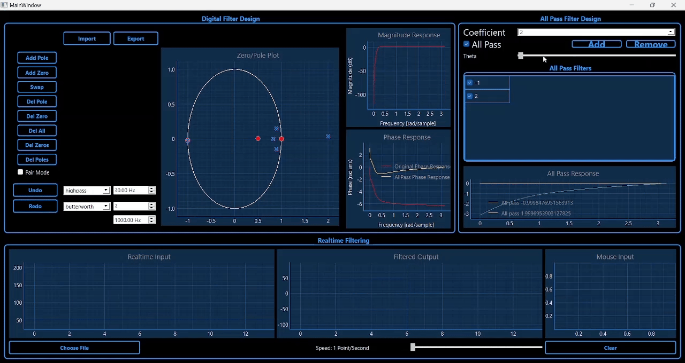

# Digital Filter Designer


## Description

- Desktop Application Designed To Enable Users To Design Custom Digital Filters
- This Application Visualizes The Filter's Magnitude And Frequency Response
- Allows Real Time Signal Filtering & Phase Correction Using All Pass Filters

## Tech Stack Used

|**Functionality** | |
|--- | --- |
|**UI** | |
|**Styling** | [](#)|

## Features
### 1. Creating Custom Filter
- Create Any Custom Filter By Adding/Removing Zeros & Poles
- Adding Is Done By Right Clicking Inside Unit Circle, Removing Is Done Via Left Clicking On Specific Zero/Pole Then Using Delete Button
- Change The Custom Design Via Various Control Buttons Like Swap, Undo, Redo, Pair Mode (Adding Conjugates)


### 2. Manipulation Of Zero/Pole Plot
- Change The Location Of Zeros & Poles In Interactive Z-Plane Via Mouse Dragging


### 3. Saving Custom Filter
- Export & Import Your Custom Filter Design
   


### 4. Built In Filter Library
- Use Most Famous Filter Types Including Lowpass, Highpass & Bandpass Filters
- Control The Cutoff Frequency, Order, Sampling Frequency Of The Filter
   

### 5. Applying Filter On Browsed Signal
- Apply Desgined Filter On Browsed Signal Having More Than 10000 Points Simulating Realtime Input Signal
- Control The Speed Of Filtering Process
   

### 6. User Input Signal
- Allow For Realtime User Input Signal Using Mouse Movement Inside Input Area
   

### 7. Phase Correction Using All Pass Filter
- Design An All Pass Filter To Correct For The Phase
   

### 8. Generation Of C Code For Designed Filter
- Generate C Code For Custom Designed Filter
   


## Installation

1. Make Sure That Pip & Python Are Installed On Your System

2. Clone The Repo Onto Your Local System or Download The Zip File & Extract It
   ```bash
    git clone https://github.com/mostafa-aboelmagd/digital-filter-designer.git
    ```

3. Nagivate To The Project's Directory 
   
4. Install The Required Libraries
    ```bash
    pip install -r requirements.txt
    ```

5. Run `main.py` File
    ```bash
    python main.py
    ```

## Contributors

| Name | GitHub | LinkedIn |
| ---- | ------ | -------- |
| Mostafa Ayman | [](https://github.com/mostafa-aboelmagd) | [](https://www.linkedin.com/in/mostafa--aboelmagd/) |
| Ali Zayan | [](https://github.com/alizayan684) | [](https://www.linkedin.com/in/%D8%B9%D9%84%D9%8A-%D8%B2%D9%8A%D8%A7%D9%86-%F0%9F%94%BB%F0%9F%87%B5%F0%9F%87%B8-b98239264/) |
| Zeyad Amr | [](https://github.com/Zisco2002)| [](https://www.linkedin.com/in/zeyad-amr-3506b225b/) |
| Mostafa Mousa | [](https://github.com/MostafaMousaaa) | [](https://www.linkedin.com/in/mostafa-mousa-b81b8322a/) |
| Omar Khaled | [](#)| [](https://www.linkedin.com/in/omar-khaled-064b7930a/) |
